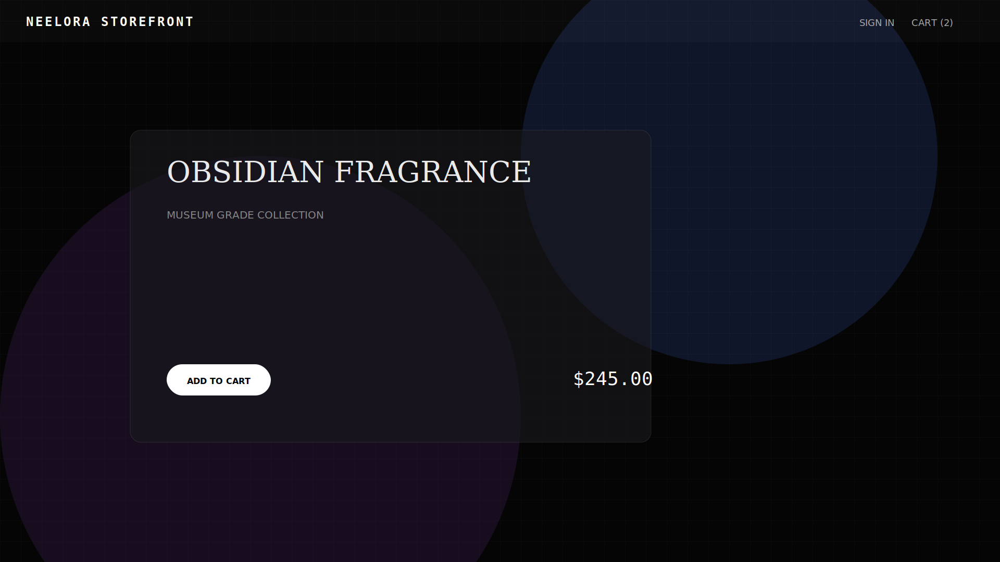
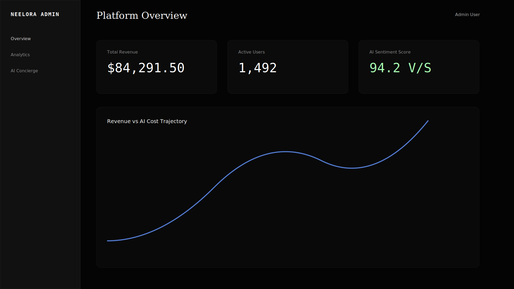

# Neelora | Premium AI-Powered E-Commerce

Neelora is a conceptual, next-generation e-commerce platform built around artificial intelligence. The platform combines a museum-grade aesthetic with real-time dynamic pricing, an integrated AI concierge, and an ultra-modern animated user interface. 

The platform uses layers of pure CSS and Canvas to bring the storefront alive:
- **Layer 1:** Deep space HTML5 Canvas starfield and shooting stars.
- **Layer 2:** Real-time 3D rotating perspective globe.
- **Layer 3:** Shifting aurora conic gradients.
- **Layer 4:** Pulsing grid mesh.
- **Layer 5:** Floating radial-gradient orbs.
- **Layer 6:** Sweeping radar scan beam overlay.

This repository relies on a modern microservices-inspired monorepo architecture, leveraging Next.js, Turbopack, and Docker for scalable deployment.

## 📸 Gallery

<p align="center">
  
  <br/>
  <em>Storefront Interface - Dark Museum Grade Aesthetic</em>
</p>

<p align="center">
  
  <br/>
  <em>Administrative Dashboard - Real-time AI Sentiment Analytics</em>
</p>
## ✨ Key Features

- **Real-Time Render Engine UI:** A highly immersive 3D store experience featuring dynamic specular highlights, a tilting HUD rendering interface, holographic foil overlays, and an active wireframe globe background.
- **AI Concierge (`ai-core`):** A sophisticated conversational assistant built to guide users, recommend products, and answer precise questions regarding the Neelora assembly.
- **Dynamic Pricing Engine:** Prices intelligently adjust based on real-time simulated product demand ratios, showcasing reactive pricing strategies.
- **Museum-Grade Design System (`lumina-ui`):** A custom React component library prioritizing brutalist/modernist principles with an "Obsidian & Bone" color palette, serif typography, and brass accent styling.
- **Advanced Animations:** Ambient particles, aurora gradients, scrolling marquee tickers, scroll-triggered reveals, parallax imagery, and CSS-layered complex backgrounds.
- **Product Modal & Cart Management:** A seamless slide-out cart sidebar, fully animated checkout workflows, and immersive product-focus overlays.

## 🏗️ Architecture Stack

This project is built as a **Turborepo** monorepo featuring the following applications and packages:

### Applications (`/apps`)
- **`storefront`**: The primary Next.js (App Router) user application running the main shop experience, complete with animations, rendering HUDs, and product displays.
- **`dashboard`**: The administrative Next.js application designed for viewing sales analytics, AI sentiment summaries, and backend store management.

### Packages (`/packages`)
- **`lumina-ui`**: Shared, highly-styled React component library (`ObsidianCard`, `PillButton`, `GlassCard`, `NeonButton`).
- **`ai-core`**: The central intelligence dependency containing logic for the conversational concierge engine, dynamic pricing models, and embedded product database.

### Core Technologies
- **Framework:** Next.js 14+ with Turbopack
- **Animations:** Framer Motion (`useScroll`, `useSpring`, `RevealOnScroll`)
- **Styling:** CSS variables, dynamic CSS Grid layouts, raw GPU-accelerated styling
- **Containerization:** Docker & Docker Compose configuration tailored for Google Cloud Platform (GCP) deployments.

## 🚀 Getting Started

### Local Development

1. **Install Dependencies:**
   ```bash
   npm install
   ```

2. **Run the Development Server (Turborepo):**
   ```bash
   npm run dev
   ```
   - Storefront runs at: `http://localhost:3000`
   - Dashboard runs at: `http://localhost:3001`

### Docker Deployment

The application is fully containerized and ready for production testing:

```bash
docker-compose up --build
```
